# Button / RTC-Wakeup Capture and Upload Flow

## Full Flow Chart

```mermaid
graph TB
    Start([Start]) --> CheckTrigger{Trigger type}

    %% Button capture path
    CheckTrigger -->|Short button press| ButtonPath[Button trigger path]
    ButtonPath --> ButtonWakeup{System state}
    ButtonWakeup -->|Waking from sleep| ButtonWakeup1[system_service_process_wakeup_event]
    ButtonWakeup -->|Running| ButtonWakeup2[device_service single_press_callback]

    ButtonWakeup1 --> HandleButton[handle_wakeup_event<br/>WAKEUP_SOURCE_BUTTON]
    HandleButton --> SetLED1[Set LED state<br/>SYSTEM_INDICATOR_RUNNING_AP_OFF]
    SetLED1 --> Callback1[capture_callback<br/>CAPTURE_TRIGGER_BUTTON]

    ButtonWakeup2 --> DirectCall[Direct call<br/>system_service_capture_and_upload_mqtt]

    Callback1 --> DefaultCB1[default_capture_callback]
    DefaultCB1 --> WakeupTask1[wakeup_task_async]
    WakeupTask1 --> CheckMode1{Work mode check}
    CheckMode1 -->|AICAM_WORK_MODE_IMAGE| CaptureReq1[system_service_capture_request<br/>enable_ai=TRUE<br/>chunk_size=0<br/>store_to_sd=TRUE]
    CheckMode1 -->|Other modes| End1([End])

    %% RTC wakeup capture path
    CheckTrigger -->|RTC timed wakeup| RtcPath[RTC wakeup path]
    RtcPath --> RtcWakeup[system_service_process_wakeup_event<br/>detect PWR_WAKEUP_FLAG_RTC]
    RtcWakeup --> HandleRtc[handle_wakeup_event<br/>WAKEUP_SOURCE_RTC]
    HandleRtc --> Callback2[capture_callback<br/>CAPTURE_TRIGGER_RTC_WAKEUP]
    Callback2 --> DefaultCB2[default_capture_callback]
    DefaultCB2 --> WakeupTask2[wakeup_task_async]
    WakeupTask2 --> CheckMode2{Work mode check}
    CheckMode2 -->|AICAM_WORK_MODE_IMAGE| CaptureReq2[system_service_capture_request<br/>enable_ai=TRUE<br/>chunk_size=0<br/>store_to_sd=TRUE]
    CheckMode2 -->|Other modes| End2([End])

    %% Unified upload flow
    CaptureReq1 --> UnifiedEntry[system_service_capture_and_upload_mqtt]
    CaptureReq2 --> UnifiedEntry
    DirectCall --> UnifiedEntry

    UnifiedEntry --> CheckWakeupType{Wakeup type}
    CheckWakeupType -->|RTC / button wakeup| FastCapture[device_service_camera_capture_fast<br/>fast capture API]
    CheckWakeupType -->|Other cases| NormalCapture[device_service_camera_capture<br/>standard capture API]

    FastCapture --> CheckAI1{enable_ai?}
    NormalCapture --> CheckAI2{enable_ai?}

    CheckAI1 -->|TRUE| AIInference1[AI inference]
    CheckAI1 -->|FALSE| NoAI1[Skip AI]
    CheckAI2 -->|TRUE| AIInference2[AI inference]
    CheckAI2 -->|FALSE| NoAI2[Skip AI]

    AIInference1 --> GetJPEG[Get JPEG buffer]
    NoAI1 --> GetJPEG
    AIInference2 --> GetJPEG
    NoAI2 --> GetJPEG

    GetJPEG --> CheckSD{"store_to_sd && SD card mounted?"}
    CheckSD -->|TRUE| SaveSD[Save to SD card<br/>image_timestamp.jpg]
    CheckSD -->|FALSE| SkipSD[Skip SD storage]

    SaveSD --> PrepareMeta[Prepare metadata<br/>get JPEG params<br/>build MQTT metadata]
    SkipSD --> PrepareMeta

    PrepareMeta --> CheckAI3{"enable_ai && valid AI result?"}
    CheckAI3 -->|TRUE| PrepareAI[Prepare AI result<br/>get model info<br/>init MQTT AI result]
    CheckAI3 -->|FALSE| SkipAI[Skip AI result]

    PrepareAI --> CheckNetwork[Check MQTT network connection]
    SkipAI --> CheckNetwork

    CheckNetwork --> FastFail{fast_fail_mqtt?}
    FastFail -->|TRUE| CheckConnected1{MQTT connected?}
    FastFail -->|FALSE| WaitNetwork[Wait for MQTT network ready<br/>up to 15 s<br/>MQTT_NET_CONNECTED]

    CheckConnected1 -->|FALSE| Error1[Return error<br/>AICAM_ERROR_UNAVAILABLE]
    CheckConnected1 -->|TRUE| CheckMQTT
    WaitNetwork --> CheckMQTT{MQTT connected?}

    CheckMQTT -->|FALSE| Error2[Return error]
    CheckMQTT -->|TRUE| CheckSize{Image size}

    CheckSize -->|< 1MB| SingleUpload[mqtt_service_publish_image_with_ai<br/>single publish]
    CheckSize -->|>= 1MB| ChunkedUpload[mqtt_service_publish_image_chunked<br/>chunked upload<br/>default 10 KB/chunk]

    SingleUpload --> Cleanup[Release JPEG buffer]
    ChunkedUpload --> Cleanup

    Cleanup --> WaitConfirm{Upload success?}
    WaitConfirm -->|TRUE| WaitPublish[Wait for publish confirm<br/>MQTT_EVENT_PUBLISHED<br/>up to 10 s]
    WaitConfirm -->|FALSE| End3([End])

    WaitPublish --> Success([Upload done])
    Error1 --> End3
    Error2 --> End3
    End1 --> End3
    End2 --> End3

    style ButtonPath fill:#e1f5ff
    style RtcPath fill:#fff4e1
    style UnifiedEntry fill:#e8f5e9
    style FastCapture fill:#f3e5f5
    style NormalCapture fill:#f3e5f5
    style SingleUpload fill:#fff9c4
    style ChunkedUpload fill:#fff9c4
    style Success fill:#c8e6c9
```

## Key Functions

### Button capture path
- **device_service.c**: `single_press_callback()` - button callback while running
- **system_service.c**: `handle_wakeup_event(WAKEUP_SOURCE_BUTTON)` - button handling on wakeup
- **system_service.c**: `default_capture_callback(CAPTURE_TRIGGER_BUTTON)` - button-triggered callback

### RTC wakeup capture path
- **system_service.c**: `system_service_process_wakeup_event()` - process wakeup events
- **system_service.c**: `handle_wakeup_event(WAKEUP_SOURCE_RTC)` - RTC wakeup handling
- **system_service.c**: `wakeup_task_async()` - asynchronous wakeup task

### Unified upload flow
- **system_service.c**: `system_service_capture_and_upload_mqtt()` - core upload function
  - Step 1: capture (fast / standard)
  - Step 1.1: SD card storage (optional)
  - Step 2: prepare metadata
  - Step 3: prepare AI result (optional)
  - Step 3.1: check MQTT network connection
  - Step 4: MQTT upload (single / chunked)
  - Step 5: release buffers
  - Step 6: wait for publish confirmation

## Parameter Differences

| Trigger | enable_ai | chunk_size | store_to_sd | Capture API |
|---------|-----------|------------|-------------|-------------|
| Button capture (while running) | configurable | configurable | configurable | standard |
| Button capture (from wakeup) | TRUE | 0 | TRUE | fast |
| RTC wakeup capture | TRUE | 0 | TRUE | fast |
