# 按键拍照和唤醒拍照上传流程

## 完整流程图

```mermaid
graph TB
    Start([开始]) --> CheckTrigger{触发类型}
    
    %% 按键拍照路径
    CheckTrigger -->|按键短按| ButtonPath[按键触发路径]
    ButtonPath --> ButtonWakeup{系统状态}
    ButtonWakeup -->|从休眠唤醒| ButtonWakeup1[system_service_process_wakeup_event]
    ButtonWakeup -->|运行中| ButtonWakeup2[device_service single_press_callback]
    
    ButtonWakeup1 --> HandleButton[handle_wakeup_event<br/>WAKEUP_SOURCE_BUTTON]
    HandleButton --> SetLED1[设置LED状态<br/>SYSTEM_INDICATOR_RUNNING_AP_OFF]
    SetLED1 --> Callback1[capture_callback<br/>CAPTURE_TRIGGER_BUTTON]
    
    ButtonWakeup2 --> DirectCall[直接调用<br/>system_service_capture_and_upload_mqtt]
    
    Callback1 --> DefaultCB1[default_capture_callback]
    DefaultCB1 --> WakeupTask1[wakeup_task_async]
    WakeupTask1 --> CheckMode1{工作模式检查}
    CheckMode1 -->|AICAM_WORK_MODE_IMAGE| CaptureReq1[system_service_capture_request<br/>enable_ai=TRUE<br/>chunk_size=0<br/>store_to_sd=TRUE]
    CheckMode1 -->|其他模式| End1([结束])
    
    %% 唤醒拍照路径
    CheckTrigger -->|RTC定时唤醒| RtcPath[RTC唤醒路径]
    RtcPath --> RtcWakeup[system_service_process_wakeup_event<br/>检测PWR_WAKEUP_FLAG_RTC]
    RtcWakeup --> HandleRtc[handle_wakeup_event<br/>WAKEUP_SOURCE_RTC]
    HandleRtc --> Callback2[capture_callback<br/>CAPTURE_TRIGGER_RTC_WAKEUP]
    Callback2 --> DefaultCB2[default_capture_callback]
    DefaultCB2 --> WakeupTask2[wakeup_task_async]
    WakeupTask2 --> CheckMode2{工作模式检查}
    CheckMode2 -->|AICAM_WORK_MODE_IMAGE| CaptureReq2[system_service_capture_request<br/>enable_ai=TRUE<br/>chunk_size=0<br/>store_to_sd=TRUE]
    CheckMode2 -->|其他模式| End2([结束])
    
    %% 统一上传流程
    CaptureReq1 --> UnifiedEntry[system_service_capture_and_upload_mqtt]
    CaptureReq2 --> UnifiedEntry
    DirectCall --> UnifiedEntry
    
    UnifiedEntry --> CheckWakeupType{唤醒类型判断}
    CheckWakeupType -->|RTC/按键唤醒| FastCapture[device_service_camera_capture_fast<br/>快速拍照API]
    CheckWakeupType -->|其他场景| NormalCapture[device_service_camera_capture<br/>标准拍照API]
    
    FastCapture --> CheckAI1{enable_ai?}
    NormalCapture --> CheckAI2{enable_ai?}
    
    CheckAI1 -->|TRUE| AIInference1[AI推理]
    CheckAI1 -->|FALSE| NoAI1[跳过AI]
    CheckAI2 -->|TRUE| AIInference2[AI推理]
    CheckAI2 -->|FALSE| NoAI2[跳过AI]
    
    AIInference1 --> GetJPEG[获取JPEG缓冲区]
    NoAI1 --> GetJPEG
    AIInference2 --> GetJPEG
    NoAI2 --> GetJPEG
    
    GetJPEG --> CheckSD{"store_to_sd && SD卡连接?"}
    CheckSD -->|TRUE| SaveSD[保存到SD卡<br/>image_timestamp.jpg]
    CheckSD -->|FALSE| SkipSD[跳过SD存储]
    
    SaveSD --> PrepareMeta[准备元数据<br/>获取JPEG参数<br/>生成MQTT元数据]
    SkipSD --> PrepareMeta
    
    PrepareMeta --> CheckAI3{"enable_ai && AI结果有效?"}
    CheckAI3 -->|TRUE| PrepareAI[准备AI结果<br/>获取模型信息<br/>初始化MQTT AI结果]
    CheckAI3 -->|FALSE| SkipAI[跳过AI结果]
    
    PrepareAI --> CheckNetwork[检查MQTT网络连接]
    SkipAI --> CheckNetwork
    
    CheckNetwork --> FastFail{fast_fail_mqtt?}
    FastFail -->|TRUE| CheckConnected1{MQTT已连接?}
    FastFail -->|FALSE| WaitNetwork[等待MQTT网络就绪<br/>最多15秒<br/>MQTT_NET_CONNECTED]
    
    CheckConnected1 -->|FALSE| Error1[返回错误<br/>AICAM_ERROR_UNAVAILABLE]
    CheckConnected1 -->|TRUE| CheckMQTT
    WaitNetwork --> CheckMQTT{MQTT已连接?}
    
    CheckMQTT -->|FALSE| Error2[返回错误]
    CheckMQTT -->|TRUE| CheckSize{图片大小}
    
    CheckSize -->|< 1MB| SingleUpload[mqtt_service_publish_image_with_ai<br/>单次上传]
    CheckSize -->|>= 1MB| ChunkedUpload[mqtt_service_publish_image_chunked<br/>分块上传<br/>默认10KB/块]
    
    SingleUpload --> Cleanup[释放JPEG缓冲区]
    ChunkedUpload --> Cleanup
    
    Cleanup --> WaitConfirm{上传成功?}
    WaitConfirm -->|TRUE| WaitPublish[等待发布确认<br/>MQTT_EVENT_PUBLISHED<br/>最多10秒]
    WaitConfirm -->|FALSE| End3([结束])
    
    WaitPublish --> Success([上传完成])
    Error1 --> End3
    Error2 --> End3
    End1 --> End3
    End2 --> End3
    
    style ButtonPath fill:#e1f5ff
    style RtcPath fill:#fff4e1
    style UnifiedEntry fill:#e8f5e9
    style FastCapture fill:#f3e5f5
    style NormalCapture fill:#f3e5f5
    style SingleUpload fill:#fff9c4
    style ChunkedUpload fill:#fff9c4
    style Success fill:#c8e6c9
```

## 关键函数说明

### 按键拍照路径
- **device_service.c**: `single_press_callback()` - 运行中按键回调
- **system_service.c**: `handle_wakeup_event(WAKEUP_SOURCE_BUTTON)` - 唤醒时按键处理
- **system_service.c**: `default_capture_callback(CAPTURE_TRIGGER_BUTTON)` - 按键触发回调

### 唤醒拍照路径
- **system_service.c**: `system_service_process_wakeup_event()` - 处理唤醒事件
- **system_service.c**: `handle_wakeup_event(WAKEUP_SOURCE_RTC)` - RTC唤醒处理
- **system_service.c**: `wakeup_task_async()` - 异步唤醒任务

### 统一上传流程
- **system_service.c**: `system_service_capture_and_upload_mqtt()` - 核心上传函数
  - Step 1: 拍照（快速/标准）
  - Step 1.1: SD卡存储（可选）
  - Step 2: 准备元数据
  - Step 3: 准备AI结果（可选）
  - Step 3.1: 检查MQTT网络连接
  - Step 4: MQTT上传（单次/分块）
  - Step 5: 清理缓冲区
  - Step 6: 等待发布确认

## 参数差异

| 触发方式 | enable_ai | chunk_size | store_to_sd | 拍照API |
|---------|-----------|------------|-------------|---------|
| 按键拍照（运行中） | 可配置 | 可配置 | 可配置 | 标准API |
| 按键拍照（唤醒） | TRUE | 0 | TRUE | 快速API |
| RTC唤醒拍照 | TRUE | 0 | TRUE | 快速API |
